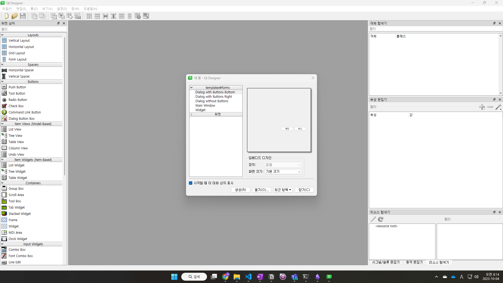
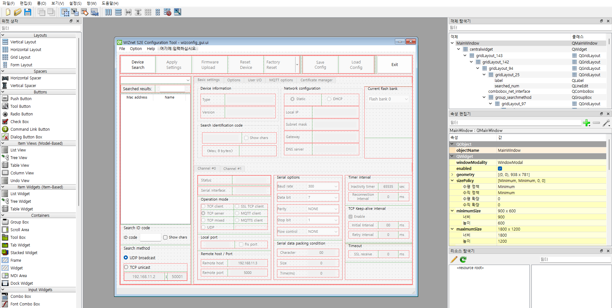
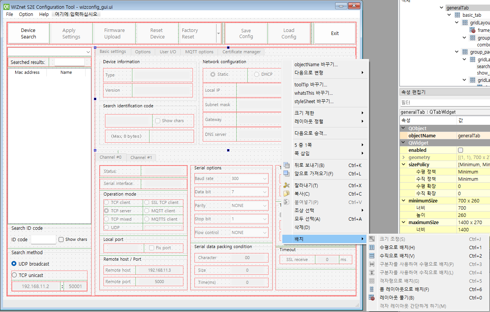
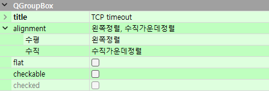
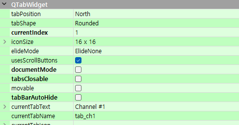
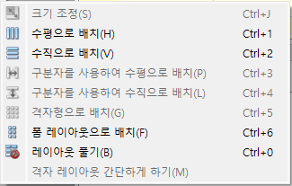
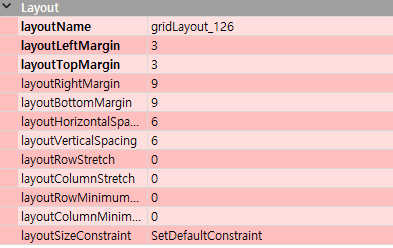

# Qt Designer로 UI 수정하기

> UI 파일(`.ui`)을 시각적으로 편집하는 방법을 설명합니다.  
> 코드를 직접 수정하지 않고 드래그 앤 드롭으로 레이아웃을 변경할 수 있습니다.  
> 개발 환경이 아직 세팅되지 않았다면 [SETUP_DEV-ko.md](SETUP_DEV-ko.md)를 먼저 진행하세요.

---

## 1단계. Qt Designer 설치 및 실행

### 방법 A — Qt 공식 설치 (권장)

1. [Qt 설치 페이지](https://www.qt.io/download-qt-installer)에서 설치 파일 다운로드
2. 설치 프로그램 실행 → Qt Account 로그인 (없으면 Skip 가능)
3. 컴포넌트 선택 화면에서 **Qt Creator** 체크 (Qt Designer가 자동 포함)
4. 설치 완료 후 Windows 시작 메뉴에서 **"Qt Designer"** 검색 → 실행

> winget으로 한 줄 설치도 가능합니다.
>
> ```powershell
> winget install Qt.QtDesigner
> ```
>
> 설치 후 마찬가지로 시작 메뉴에서 **"Qt Designer"** 를 검색해서 실행합니다.

---

### 방법 B — pyqt5-tools (개발 환경에 통합)

Qt를 별도 설치하지 않고, 개발 환경에 포함된 Designer를 쓰는 방법입니다.

```powershell
uv pip install pyqt5-tools
uv run designer
```

---

실행하면 아래와 같이 새 폼 대화상자가 나타납니다.



**"열기"** 를 클릭하고 프로젝트 폴더 안의 `gui/wizconfig_gui.ui` 파일을 선택합니다.

---

## 3단계. UI 파일 열기

파일을 열면 아래와 같이 현재 Configuration Tool의 UI 전체가 표시됩니다.



빨간 선으로 표시된 영역은 **Grid 레이아웃**이 적용된 것입니다.  
항목을 추가·수정하려면 먼저 레이아웃을 해제해야 합니다.

---

## 4단계. 화면 구성 파악

Designer 화면은 크게 세 영역으로 나뉩니다.

### 왼쪽 — 위젯 상자

추가할 수 있는 컴포넌트 목록입니다. 원하는 항목을 드래그 앤 드롭으로 캔버스에 추가합니다.

### 오른쪽 위 — 객체 탐색기

UI 컴포넌트의 트리 구조를 보여줍니다. **여기서 보이는 객체 이름이 Python 코드의 변수명**으로 그대로 사용됩니다.

### 오른쪽 아래 — 속성 편집기

선택한 객체의 세부 속성을 설정합니다.



---

## 5단계. 속성 편집기 사용법

객체를 선택하면 속성 편집기에 해당 객체의 설정이 나타납니다.

**QGroupBox 예시** (제목, 정렬 등):



**QTabWidget 예시** (탭 위치, 현재 탭 이름 등):



자주 사용하는 공통 속성:

| 속성 | 설명 |
|------|------|
| `objectName` | Python 코드에서 `self.objectName` 으로 접근되는 변수명 |
| `minimumSize` / `maximumSize` | Grid 레이아웃 안에서의 최소·최대 크기 |
| `font` | 글꼴 설정 |
| `toolTip` | 마우스 올릴 때 표시되는 설명 |
| `enabled` | 초기 활성화 여부 (이벤트에 따라 코드에서 변경) |

> 초기에 `enabled`가 해제된 항목들은 의도된 것입니다.  
> 예를 들어 첫 화면에서는 Search 버튼만 활성화되어 있고, 장치 선택 후 Setting·Upload 등이 활성화됩니다.

---

## 6단계. 레이아웃 수정

### 레이아웃 해제 후 수정하기

UI 항목 추가·이동 시에는 **레이아웃을 먼저 해제**해야 합니다.

1. 수정할 영역을 마우스 오른쪽 버튼으로 클릭
2. **배치 → 레이아웃 풀기** 선택 (`Ctrl+0`)
3. 항목 추가 또는 이동
4. 다시 마우스 오른쪽 버튼 → **배치 → 격자형으로 배치** (`Ctrl+5`)



이 프로젝트는 대부분 **격자형 배치(Grid, `Ctrl+5`)** 를 사용합니다.

### 레이아웃 속성 (Margin / Spacing)

Grid가 적용된 객체를 선택하면 Layout 속성이 나타납니다.



| 속성 | 기본값 | 설명 |
|------|-------|------|
| `layoutMargin` | 9 | 영역 외곽 여백. 기본값이 커서 상황에 맞게 줄이는 경우 많음 |
| `layoutSpacing` | 6 | 컴포넌트 간 간격 |

### 미리 보기

`Ctrl+R` 로 결과 화면을 미리 확인할 수 있습니다.

---

## 7단계. 수정 내용 확인

Designer에서 저장(`Ctrl+S`) 후 아래 명령으로 실행하면 변경 내용이 즉시 반영됩니다.

```powershell
uv run python main_gui.py
```

> 이미지 파일은 Designer에서 설정하지 않습니다. `main_gui.py` 코드에서 별도로 로드합니다.

---

## 참고 — Python 코드에서 UI 변수 사용하기

이 프로젝트는 `.ui` 파일을 직접 불러오는 방식을 사용합니다.

```python
main_window = uic.loadUiType(resource_path('gui/wizconfig_gui.ui'))[0]
```

`Main` 클래스가 `main_window`를 상속받아 Designer에서 설정한 객체 이름을 `self.objectName` 형태로 바로 사용할 수 있습니다.  
예를 들어 Designer에서 `objectName`을 `btn_search`로 설정했다면, 코드에서 `self.btn_search`로 접근합니다.

---

## 개발 문서 목차

> **굵게** 표시된 항목이 지금 보고 있는 문서입니다.

| 단계 | 문서 |
|:---:|------|
| — | [개발자 가이드 (시작 순서)](DEV_GUIDE-ko.md) |
| 1 | [환경 세팅 & 실행](SETUP_DEV-ko.md) |
| 2 | [코드 구조](ARCHITECTURE-ko.md) |
| 3 | **UI 수정 (Qt Designer) — 현재 문서** |
| 4 | [새 장치 추가](ADD_DEVICE-ko.md) |
| 5 | [테스트](TESTING-ko.md) |
| 6 | [빌드 & 배포](RELEASE-ko.md) |

[← 프로젝트 홈 · 사용자 가이드](../../README.md)
